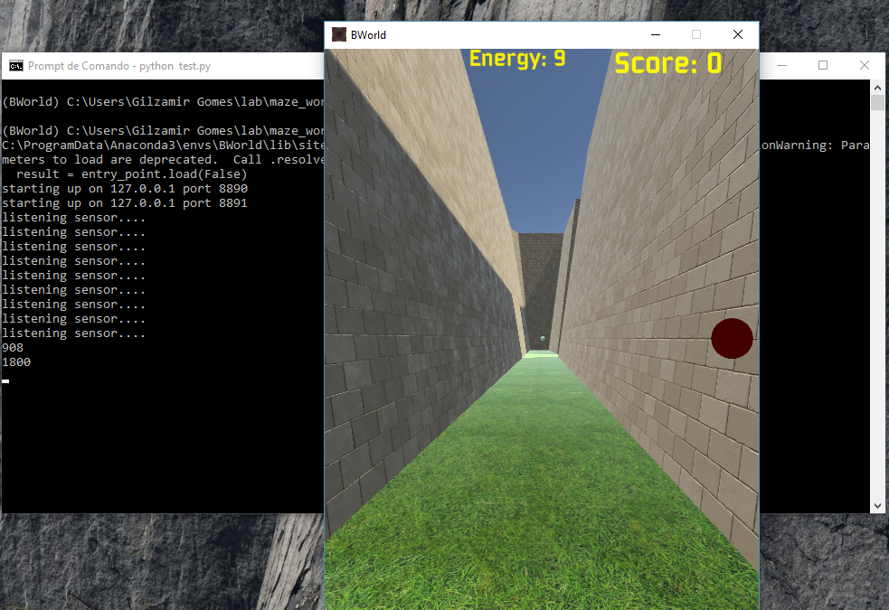

Maze World - An Environment to Virtual Reality and Artificial Intelligence Experiments.
==

Introduction
--

The Maze World is an environment to artificial intelligence and virtual reality experiments. The purpose of using this environment in virtual reality is to evaluate  virtual characters (or virtual humans) behaviors based on behavioral models.

Dependencies
--

- MazeWorld executable (For Windows, get [here]( https://1drv.ms/u/s!AkkX5pv0cl3ahJEHDznXHzVBLhR7sQ). For others operation systems, it is necessary compile using Unity3d version 2018.3 or later).

- [Gym](https://github.com/openai) version >= 0.10.9

- Python version >= 3.6. Anaconda is recommended.

- Numpy version >= 1.15.4

- Pillow version >= 5.1.0

Depending on the type of agent to run, you may need to use tensorflow (version> = 1.12.0), keras (version> = 2..2.4), and other useful Python-based tools. Tipical setup uses:

- gym                 0.10.9
- h5py                2.9.0
- imageio             2.4.1
- Keras               2.2.4
- Markdown            3.0.1
- matplotlib          3.0.1
- numpy               1.15.4
- Pillow              5.4.0
- pip                 18.1
- scikit-image        0.14.0
- scipy               1.1.0
- tensorboard         1.12.1
- tensorflow          1.12.0

Support
--

This environment should work on any operating system that supports its dependencies. However, for this, it is necessary to compile and generate the executable corresponding to the underlying operating system. This can be done with Unity3D, which runs officially only on MacOSX and Windows, although executables can be generated for GNU / Linux as well.

Especially for Windows 10, I make available a version already compiled and packaged [here]( https://1drv.ms/u/s!AkkX5pv0cl3ahJEHDznXHzVBLhR7sQ).

Setup
--

Install all dependencies in python invironment that will be used to simulatation. Clone or download this repository. Go to the diretory gym in MazeWorld downloaded repo and enter the following command:

        pip install -e .

After this, create the environment path MW_PATH poiting to MazeWorld executable. For example, in Windows 10 command line  (cmd):

        set MW_PATH=\App\BWorld.exe

In this case, MazeWorld executable is installed in c:\\App directory.

Now, go to agents\test directory of repository and enter the following command to test if installation is ok:

        python test.py

If a window appears (As the next image shows) as the window of a first person game and no error is displayed on the screen then the installation is ok!!!

To uses experimental agent, go to agents/dqn directory of repository, and enter the following command:

        python learning.py.

Results on the progress of agent learning will be shown on the screen. Soon, I'll use tensorboard to keep up with the progress of the training.

Note
-
This environment is under development, soon I will post more information about experiments and results obtained with the development of this environment.

